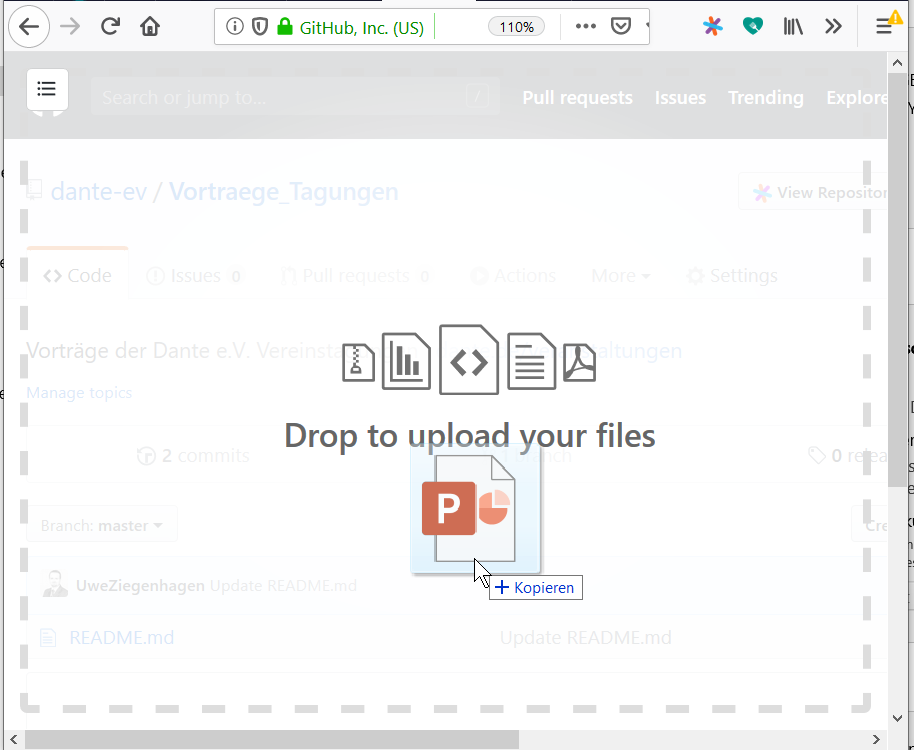

# How to add your talk

This file describes how to add your talk from [an event of DANTE e.V.](https://www.dante.de/veranstaltungen/) to this repository.

1. Create a GitHub account
2. Go to <https://github.com/dante-ev/Vortraege_Tagungen>
3. Click on the directory of the event. For instance "2019-Herbst".
4. Drop the file  
   
5. Name the file following the pattern `year-[Fruehjahr|Herbst]/firstname lastname - titleofyourtalk - [dante]year-[fruehjahr|herbst].pdf`  
   Example: `2019-Herbst/Oliver Kopp - LaTeX Template Generator - dante2019-herbst.pdf`
6. Commit
7. Create the pull request
